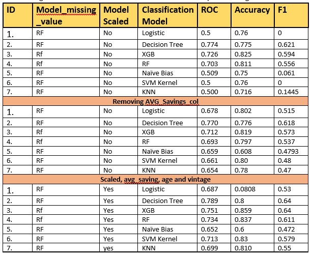

# Read Me

## Credit Card Recommendation Model: Minimizing False Positives through Binary Classification
#

## Problem Statement
Identify the potential credit-card customer from the data, so as to increase the hit ratio when credit card is recommended. 
Hackathon-Analytics-Vidya-May-2021, May-2021

### Approach: 
The problem statement clearly states that the model has to be built such that it identifies the customer those could have higher probability of taking a credit card when recommended. So, the problem is of binary classification with target of minimizing False Positive. With this aim, The model was built.

### Data-Preprocessing/Feature engineering:
In the preprocessing step the data was checked for:

Basic data infos like: 
-	data.shape: To see the shape of data
-	Data.describe(): to get an idea abut missing data, outliers, spread of data 
-	Data.head(): to view data
-	Data.types: to  see the categorical and continuous data

Removed the ‘ID’ column as it would not have been of any use in training

### Duplicate Rows:
-	To remove the duplicate rows from the data. There were 21 duplicate rows

### Missing data:  
-	Missing data was present in the dataset, in the 'Credit_Product' column. 
-	Solution applied: As Credit_Product' column was not continuous data so could not be imputed by mean, median or mode . 
-	Nor could it be dropped as out of ‘29325’ missing values, 24,975 belong to ‘Is_Lead’ = 1, category. 
-	So tried filling the missing values with the Machine Learning Imputers. Tried two approaches: 
1.	Random forest imputer 
2.	DataWig Imputer

-	Tried both the imputers but finally went with the Datawig Imputer as it had these benefits:
    1.	It could handle categorical data, no encoding needed
    2.	Based on neural network so could handle outliers.
    3.	Data generated by it, resulted in better performance. 

#### Note: 
- Used a separate jupyter notebook to generate this data and saved the output as Datawig_train.csv and Datawig_test.csv , as the training and prediction required a lot of time, which was not feasible to run everytime.
- Also, ‘Is_Lead’ is used as a feature in training Datawig model for train data model as it would increase the accuracy, but not in training of test data model as it was not available. 

### Name of notebook:  Missing_value_imputer.ipynb

### Count of Categorical features:
These two reasons were the main motivations:
1.	To know the number of dummy variables that would be formed
2.	To see if any value in the column is biased (e.g. very minimal in number, like 100 :1 in ratio) such that it has almost no effect 
(Corelation can solve this thing, yet these practices give intuition about the data, its spread etc)

### Detecting Outliers:

-	There are 4 features of type int,including Is_Lead
-	Cheacked for the outliers, with 1.5IQR as range and also with BoxPlot.
-	Only 'Avg_Account_Balance' had outliers, which were not discarded. As there are people who can have very high 'Avg_Account_Balance'. They can be less in numbers that doesn’t mean its an anomaly.    
-	Checked for Is_Lead too just in case if it has some strange values.

### HeatMap:
To view the correlation.

### Binning: 
Looked at the spread of the features: ‘Age’, ‘Region’,’Gender’,’Occupation’ with respect to ‘Is_Lead’.
1. ‘Age’ feature:  Noticed this trend in this feature:
    -	Age <=32 -> people belonging to this age group have less than 10% chances for being a Yes to ‘Is_Lead’ 
    -	33<= Age <=41 Have 10 to 30 percent , No for being a Yes to ‘Is_Lead’ 
    -	42<= Age <=64 = Have 35 to 38% chances of being a lead
    -	65<= Age <=74 = Have 25 to 28% chances of being a lead
    -	Age 75+ = Have 32 to 35% changes of being a lead

    So, grouped them accordingly in 5 different groups, making Age a categorical feature.

2. ‘Region_Code’: 
It had 35 regions. 
This too had some region with more probability for a Lead than the others.
So grouped them accordingly.
    -	Regions: RG267, RG270,RG256,RG266,RG252,RG264 had less than 15% of having a lead
    -	Regions:  RG259,RG282,RG257,RG260,RG262,RG271,RG261,RG275,RG274,RG250 had 15 to 20% probability of having a lead
    -	Region: RG273,RG280,RG255,RG251,RG277,RG279,RG263,RG269,RG258,RG272,RG278,RG281,RG254 had 20 to 25% probability of having a lead
    -	Region: RG283,RG284,RG268,RG276,RG253,RG265 had more than 25% probability of having a lead
 
### Encoding of the categorical features:
-	The following features were encoded using pd.get_dummies.
'Gender', 'Credit_Product',  'Region_Code', 'Occupation',  'Channel_Code', 'Is_Active', 'Age'
-	After that one of the columns generated by each features were removed to remove the dummy variable trap.
-	The columns removed were: 
'Gender_Female', 'Is_Active_No', 'Channel_Code_X4', 'Occupation_Other', 'Region_Code_reg_4', 'Credit_Product_No', 'Age_grp_1'      
-	The rest of the columns from each feature were sufficient to explain the model.

### Scaling:
-	MinMaxScaler, RobustScaler were used to scale ‘Vintage’ and ‘Avg_Account_Balance’ respectively.
-	Used MinMaxScaler with ‘Vintage’ as there as no outlier present and it would preserve the variability of data.
-	Used RobustScaler with ‘Avg_Account_Balance’ as it had outliers and as the name suggest this scaler is robust to outliers.  

### Splitting of train data
Used train_test_split to split the training data in 80:20 ratio for validating the trained models.

### Model:

The final model is an ensemble model.

- Had tried many models, but the result was not good. As can be seen with the accuracy reported while using different algorithms on data which Used Random Forest to impute missing values. 

- Even tried many neural networks, but the result was not as expected. The models overfitted the training data. Even after trying dropout layers and fltr optimizer, which is known to overcome overfitting.

So finally decided to use the power of more than one algorithms.
Reason: Where one model fails the other two can vote it out.
Since, XGBoost and Decision Tree, LGBM and CatBoost gave almost same AUC score but with Different F1score, so tried different combinations of them. 
Finally, the best result with good F1score was produced by XGBoost and LGBM combination.

So, the final model is an ensemble model with voting classifier as XGBoost and LGBM. 

